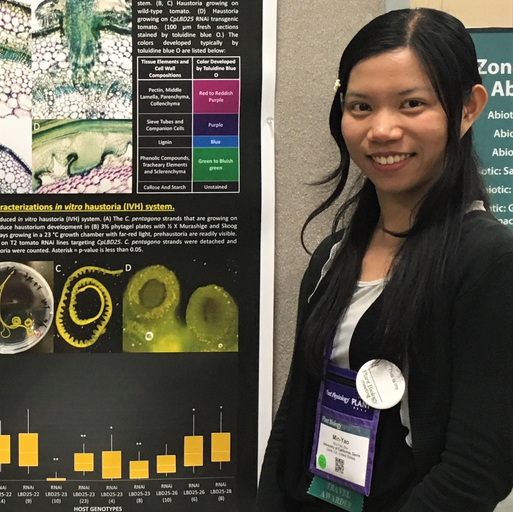

# BIS15W2021_mjhu

Welcome! This Min-Yao's repository includes all of the .rmd files and data that we use in class.

## Contact Info

[Min-Yao Jhu](mailto:minjhu@ucdavis.edu)  

I am a sixth-year Ph.D. candidate in the Plant Biology Graduate Program at UC Davis.
I have 3 years of experience teaching as a teaching assistant for several courses, including Plant Physiology (PLB111), Plant Growth and Development (PLB112), and Introduction to Biology: Biodiversity and the Tree of Life (BIS2C). I enjoyed the opportunity to put what I had learned in my courses and lab research into practice on teaching students.

## Class Links  

[BIS 15L Webpage](https://jmledford3115.github.io/datascibiol/)  
[BIS15-W21-DataScienceBiologists](https://github.com/jmledford3115/BIS15L-W21-DataScienceBiologists)  
[College of Biological Sciences](https://biology.ucdavis.edu/)  

## Thank You!  

Don't forget to leave a ⭐ if you found this useful.
