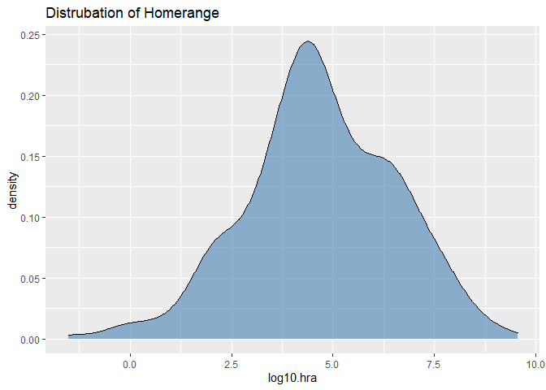
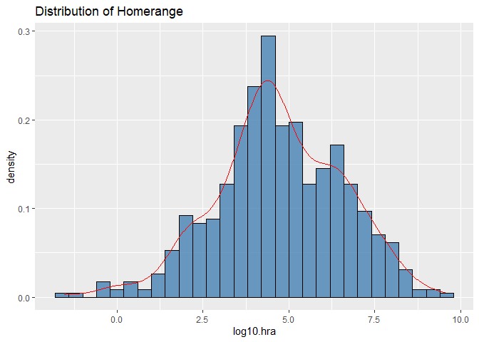
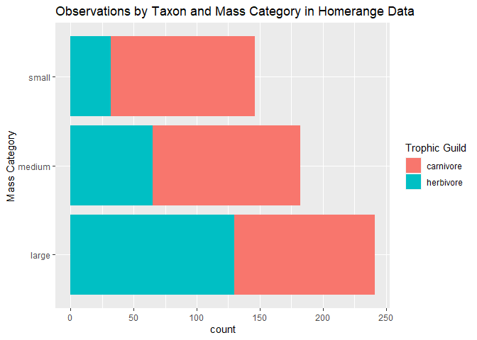
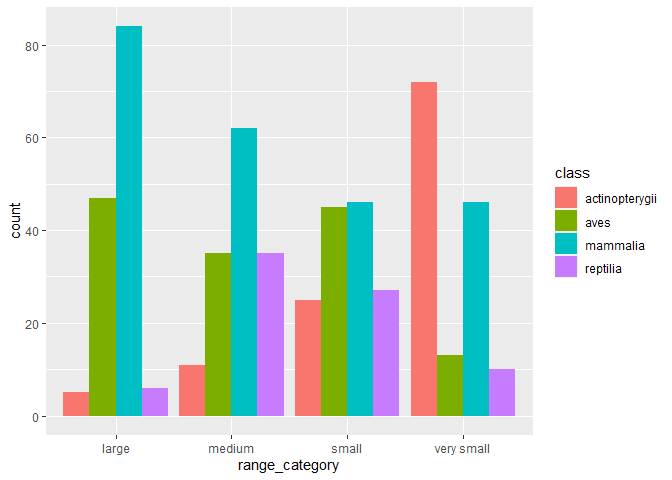

## Learning Goals
*At the end of this exercise, you will be able to:*    
1. Build histograms and density plots.
2. Adjust colors using R's built-in color options.  
3. Create new categories with `case_when()` and use those categories to build plots.  
4. Build line plots.  

## Group project  
Please make sure that you have 1-2 data sets to share with your group member during part 2 of today's lab. You need to decide which of the data sets you will use for your project.  

## Resources
- [ggplot2 cheatsheet](https://www.rstudio.com/wp-content/uploads/2015/03/ggplot2-cheatsheet.pdf)
- [R for Data Science](https://r4ds.had.co.nz/)
- [R Cookbook](http://www.cookbook-r.com/)
- [`ggplot` themes](https://ggplot2.tidyverse.org/reference/ggtheme.html)
- [Rebecca Barter `ggplot` Tutorial](http://www.rebeccabarter.com/blog/2017-11-17-ggplot2_tutorial/)
- [R Color Brewer](http://colorbrewer2.org/#type=sequential&scheme=BuGn&n=3)

## Install `RColorBrewer` and `paletteer`
`RColorBrewer` and `paletteer` are helpful in selecting palettes of color that work with your data. Please install these now, we will work with them in part 2 of today's lab.

```r
#install.packages("RColorBrewer")
#install.packages("paletteer")
#install.packages("magrittr")
```

## Load the libraries

```r
library(tidyverse)
library(RColorBrewer)
library(paletteer)
library(janitor)
library(here)
```


```r
options(scipen=999) #cancels the use of scientific notation for the session
```

## Data
For this tutorial, we will use two data sets.  

[Desert ecology](http://esapubs.org/archive/ecol/E090/118/). The data are from: S. K. Morgan Ernest, Thomas J. Valone, and James H. Brown. 2009. Long-term monitoring and experimental manipulation of a Chihuahuan Desert ecosystem near Portal, Arizona, USA. Ecology 90:1708.  

```r
deserts <- read_csv(here("lab11", "data", "surveys_complete.csv"))
```

[Homerange](http://datadryad.org/resource/doi:10.5061/dryad.q5j65/1). The data are from: Tamburello N, Cote IM, Dulvy NK (2015) Energy and the scaling of animal space use. The American Naturalist 186(2):196-211. http://dx.doi.org/10.1086/682070.  

```r
homerange <- read_csv(here("lab11", "data", "Tamburelloetal_HomeRangeDatabase.csv"))
```

## Line plots
Line plots are great when you need to show changes over time. Here we look at the number of samples for species DM and DS over the years represented in the data.  

```r
deserts %>% 
  filter(species_id=="DM" | species_id=="DS") %>% 
  group_by(year, species_id) %>% 
  summarise(n=n())
```

```
## `summarise()` has grouped output by 'year'. You can override using the `.groups` argument.
```

```
## # A tibble: 47 x 3
## # Groups:   year [26]
##     year species_id     n
##    <dbl> <chr>      <int>
##  1  1977 DM           264
##  2  1977 DS            98
##  3  1978 DM           389
##  4  1978 DS           320
##  5  1979 DM           209
##  6  1979 DS           204
##  7  1980 DM           493
##  8  1980 DS           346
##  9  1981 DM           559
## 10  1981 DS           354
## # ... with 37 more rows
```

```r
glimpse(deserts)
```

```
## Rows: 34,786
## Columns: 13
## $ record_id       <dbl> 1, 2, 3, 4, 5, 6, 7, 8, 9, 10, 11, 12, 13, 14, 15, ...
## $ month           <dbl> 7, 7, 7, 7, 7, 7, 7, 7, 7, 7, 7, 7, 7, 7, 7, 7, 7, ...
## $ day             <dbl> 16, 16, 16, 16, 16, 16, 16, 16, 16, 16, 16, 16, 16,...
## $ year            <dbl> 1977, 1977, 1977, 1977, 1977, 1977, 1977, 1977, 197...
## $ plot_id         <dbl> 2, 3, 2, 7, 3, 1, 2, 1, 1, 6, 5, 7, 3, 8, 6, 4, 3, ...
## $ species_id      <chr> "NL", "NL", "DM", "DM", "DM", "PF", "PE", "DM", "DM...
## $ sex             <chr> "M", "M", "F", "M", "M", "M", "F", "M", "F", "F", "...
## $ hindfoot_length <dbl> 32, 33, 37, 36, 35, 14, NA, 37, 34, 20, 53, 38, 35,...
## $ weight          <dbl> NA, NA, NA, NA, NA, NA, NA, NA, NA, NA, NA, NA, NA,...
## $ genus           <chr> "Neotoma", "Neotoma", "Dipodomys", "Dipodomys", "Di...
## $ species         <chr> "albigula", "albigula", "merriami", "merriami", "me...
## $ taxa            <chr> "Rodent", "Rodent", "Rodent", "Rodent", "Rodent", "...
## $ plot_type       <chr> "Control", "Long-term Krat Exclosure", "Control", "...
```


```r
deserts$year <- as.factor(deserts$year)
```


```r
glimpse(deserts)
```

```
## Rows: 34,786
## Columns: 13
## $ record_id       <dbl> 1, 2, 3, 4, 5, 6, 7, 8, 9, 10, 11, 12, 13, 14, 15, ...
## $ month           <dbl> 7, 7, 7, 7, 7, 7, 7, 7, 7, 7, 7, 7, 7, 7, 7, 7, 7, ...
## $ day             <dbl> 16, 16, 16, 16, 16, 16, 16, 16, 16, 16, 16, 16, 16,...
## $ year            <fct> 1977, 1977, 1977, 1977, 1977, 1977, 1977, 1977, 197...
## $ plot_id         <dbl> 2, 3, 2, 7, 3, 1, 2, 1, 1, 6, 5, 7, 3, 8, 6, 4, 3, ...
## $ species_id      <chr> "NL", "NL", "DM", "DM", "DM", "PF", "PE", "DM", "DM...
## $ sex             <chr> "M", "M", "F", "M", "M", "M", "F", "M", "F", "F", "...
## $ hindfoot_length <dbl> 32, 33, 37, 36, 35, 14, NA, 37, 34, 20, 53, 38, 35,...
## $ weight          <dbl> NA, NA, NA, NA, NA, NA, NA, NA, NA, NA, NA, NA, NA,...
## $ genus           <chr> "Neotoma", "Neotoma", "Dipodomys", "Dipodomys", "Di...
## $ species         <chr> "albigula", "albigula", "merriami", "merriami", "me...
## $ taxa            <chr> "Rodent", "Rodent", "Rodent", "Rodent", "Rodent", "...
## $ plot_type       <chr> "Control", "Long-term Krat Exclosure", "Control", "...
```


```r
deserts %>% 
  filter(species_id=="DM" | species_id=="DS") %>% 
  group_by(year, species_id) %>% 
  summarise(n=n()) %>% 
  ggplot(aes(x=year, y=n, group=species_id, color=species_id))+
  geom_line()+
  geom_point(shape=1)+
  theme(axis.text.x = element_text(angle = 60, hjust = 1))+
  labs(title = "Number of samples for species DM",
       x = "Year",
       fill = "n")
```

```
## `summarise()` has grouped output by 'year'. You can override using the `.groups` argument.
```

<!-- -->

## Histograms
Histograms are frequently used by biologists; they show the distribution of continuous variables. As students, you almost certainly have seen histograms of grade distributions. Without getting into the statistics, a histogram `bins` the data and you specify the number of bins that encompass a range of observations. For something like grades, this is easy because the number of bins corresponds to the grades A-F. By default, R uses a formula to calculate the number of bins but some adjustment is often required.  

What does the distribution of body mass look like in the `homerange` data?

```r
homerange %>% 
  ggplot(aes(x = log10.mass)) +
  geom_histogram(alpha = 0.6, color = "black", fill = "deeppink4", bins=40) +
  labs(title = "Distribution of Body Mass")
```

<!-- -->

Let's play with the colors. This shows all 657 of R's built-in colors. Notice that `color` and `fill` do different things!

```r
#grDevices::colors()
```

## Density plots  
Density plots are similar to histograms but they use a smoothing function to make the distribution more even and clean looking. They do not use bins.

```r
homerange %>% 
  ggplot(aes(x = log10.mass)) +
  geom_density(fill = "steelblue", alpha = 0.6, color = "black")+
  labs(title = "Distribution of Body Mass")
```

<!-- -->

I like to see both the histogram and the density curve so I often plot them together. Note that I assign the density plot a different color.

```r
homerange %>% 
  ggplot(aes(x=log10.mass)) +
  geom_histogram(aes(y = ..density..), binwidth = 0.4, fill = "steelblue", alpha = 0.8, color = "black")+
  geom_density(color = "red")+
  labs(title = "Distribution of Body Mass")
```

<!-- -->

## Practice
1. Make a histogram of `log10.hra`. Make sure to add a title.

```r
homerange %>% 
  ggplot(aes(x=log10.hra))+
  geom_histogram(fill="steelblue", alpha = 0.6, color="black", bins = 40)+
  labs(title = "Distrubation of Homerange")
```

<!-- -->

2. Now plot the same variable using `geom_density()`.

```r
homerange %>% 
  ggplot(aes(x=log10.hra))+
  geom_density(fill="steelblue", alpha = 0.6, color="black")+
  labs(title = "Distrubation of Homerange")
```

<!-- -->

3. Combine them both!

```r
homerange %>% 
  ggplot(aes(x=log10.hra)) +
  geom_histogram(aes(y = ..density..), binwidth = 0.4, fill = "steelblue", alpha = 0.8, color = "black")+
  geom_density(color = "red")+
  labs(title = "Distribution of Homerange")
```

<!-- -->

## Create Categories with mutate and case_when()
`case_when()` is a very handy function from `dplyr` which allows us to calculate a new variable from other variables. We use `case_when()` within `mutate()` to do this.`case_when()` allows us to specify multiple conditions. Let's reclassify the body mass variable into a new factor variable with small, medium, and large animals. 

```r
glimpse(homerange)
```

```
## Rows: 569
## Columns: 24
## $ taxon                      <chr> "lake fishes", "river fishes", "river fi...
## $ common.name                <chr> "american eel", "blacktail redhorse", "c...
## $ class                      <chr> "actinopterygii", "actinopterygii", "act...
## $ order                      <chr> "anguilliformes", "cypriniformes", "cypr...
## $ family                     <chr> "anguillidae", "catostomidae", "cyprinid...
## $ genus                      <chr> "anguilla", "moxostoma", "campostoma", "...
## $ species                    <chr> "rostrata", "poecilura", "anomalum", "fu...
## $ primarymethod              <chr> "telemetry", "mark-recapture", "mark-rec...
## $ N                          <chr> "16", NA, "20", "26", "17", "5", "2", "2...
## $ mean.mass.g                <dbl> 887.00, 562.00, 34.00, 4.00, 4.00, 3525....
## $ log10.mass                 <dbl> 2.9479236, 2.7497363, 1.5314789, 0.60206...
## $ alternative.mass.reference <chr> NA, NA, NA, NA, NA, NA, NA, NA, NA, NA, ...
## $ mean.hra.m2                <dbl> 282750.00, 282.10, 116.11, 125.50, 87.10...
## $ log10.hra                  <dbl> 5.4514026, 2.4504031, 2.0648696, 2.09864...
## $ hra.reference              <chr> "Minns, C. K. 1995. Allometry of home ra...
## $ realm                      <chr> "aquatic", "aquatic", "aquatic", "aquati...
## $ thermoregulation           <chr> "ectotherm", "ectotherm", "ectotherm", "...
## $ locomotion                 <chr> "swimming", "swimming", "swimming", "swi...
## $ trophic.guild              <chr> "carnivore", "carnivore", "carnivore", "...
## $ dimension                  <chr> "3D", "2D", "2D", "2D", "2D", "2D", "2D"...
## $ preymass                   <dbl> NA, NA, NA, NA, NA, NA, 1.39, NA, NA, NA...
## $ log10.preymass             <dbl> NA, NA, NA, NA, NA, NA, 0.1430148, NA, N...
## $ PPMR                       <dbl> NA, NA, NA, NA, NA, NA, 530, NA, NA, NA,...
## $ prey.size.reference        <chr> NA, NA, NA, NA, NA, NA, "Brose U, et al....
```


```r
homerange %>% 
  select(log10.mass) %>% 
  summarise(min=min(log10.mass),
            max=max(log10.mass))
```

```
## # A tibble: 1 x 2
##      min   max
##    <dbl> <dbl>
## 1 -0.658  6.60
```


```r
summary(homerange$log10.mass)
```

```
##    Min. 1st Qu.  Median    Mean 3rd Qu.    Max. 
## -0.6576  1.6990  2.5185  2.5947  3.3324  6.6021
```


```r
homerange <- homerange %>% 
             mutate(mass_category = case_when(log10.mass <= 1.75 ~ "small",
                                              log10.mass > 1.75 & log10.mass <= 2.75 ~ "medium",
                                              log10.mass > 2.75 ~ "large"))
```


```r
glimpse(homerange)
```

```
## Rows: 569
## Columns: 25
## $ taxon                      <chr> "lake fishes", "river fishes", "river fi...
## $ common.name                <chr> "american eel", "blacktail redhorse", "c...
## $ class                      <chr> "actinopterygii", "actinopterygii", "act...
## $ order                      <chr> "anguilliformes", "cypriniformes", "cypr...
## $ family                     <chr> "anguillidae", "catostomidae", "cyprinid...
## $ genus                      <chr> "anguilla", "moxostoma", "campostoma", "...
## $ species                    <chr> "rostrata", "poecilura", "anomalum", "fu...
## $ primarymethod              <chr> "telemetry", "mark-recapture", "mark-rec...
## $ N                          <chr> "16", NA, "20", "26", "17", "5", "2", "2...
## $ mean.mass.g                <dbl> 887.00, 562.00, 34.00, 4.00, 4.00, 3525....
## $ log10.mass                 <dbl> 2.9479236, 2.7497363, 1.5314789, 0.60206...
## $ alternative.mass.reference <chr> NA, NA, NA, NA, NA, NA, NA, NA, NA, NA, ...
## $ mean.hra.m2                <dbl> 282750.00, 282.10, 116.11, 125.50, 87.10...
## $ log10.hra                  <dbl> 5.4514026, 2.4504031, 2.0648696, 2.09864...
## $ hra.reference              <chr> "Minns, C. K. 1995. Allometry of home ra...
## $ realm                      <chr> "aquatic", "aquatic", "aquatic", "aquati...
## $ thermoregulation           <chr> "ectotherm", "ectotherm", "ectotherm", "...
## $ locomotion                 <chr> "swimming", "swimming", "swimming", "swi...
## $ trophic.guild              <chr> "carnivore", "carnivore", "carnivore", "...
## $ dimension                  <chr> "3D", "2D", "2D", "2D", "2D", "2D", "2D"...
## $ preymass                   <dbl> NA, NA, NA, NA, NA, NA, 1.39, NA, NA, NA...
## $ log10.preymass             <dbl> NA, NA, NA, NA, NA, NA, 0.1430148, NA, N...
## $ PPMR                       <dbl> NA, NA, NA, NA, NA, NA, 530, NA, NA, NA,...
## $ prey.size.reference        <chr> NA, NA, NA, NA, NA, NA, "Brose U, et al....
## $ mass_category              <chr> "large", "medium", "small", "small", "sm...
```

Here we check how the newly created body mass categories compare across `trophic.guild`. 

```r
homerange %>% 
  ggplot(aes(x = mass_category, fill = trophic.guild)) +
  geom_bar() +
  coord_flip() +
  labs(title = "Observations by Taxon and Mass Category in Homerange Data",
       x = "Mass Category",
       fill = "Trophic Guild")
```

<!-- -->

## Practice
1. Use case_when() to make a new column `range_category` that breaks down `log10.hra` into very small, small, medium, and large classes based on quartile.

```r
summary(homerange$log10.hra)
```

```
##    Min. 1st Qu.  Median    Mean 3rd Qu.    Max. 
##  -1.523   3.653   4.595   4.709   6.016   9.550
```


```r
library(gtools)
quartiles <- quantcut(homerange$log10.hra)
table(quartiles)
```

```
## quartiles
## [-1.52,3.65]  (3.65,4.59]  (4.59,6.02]  (6.02,9.55] 
##          143          142          142          142
```


```r
homerange <- homerange %>% 
  mutate(range_category = case_when(log10.hra< 3.65 ~ "very small",
                                    log10.hra>=3.65 & log10.hra <4.59 ~ "small",
                                    log10.hra>=4.59 & log10.hra <6.02 ~ "medium",
                                    log10.hra>=6.02 ~ "large"))
```


```r
glimpse(homerange)
```

```
## Rows: 569
## Columns: 26
## $ taxon                      <chr> "lake fishes", "river fishes", "river fi...
## $ common.name                <chr> "american eel", "blacktail redhorse", "c...
## $ class                      <chr> "actinopterygii", "actinopterygii", "act...
## $ order                      <chr> "anguilliformes", "cypriniformes", "cypr...
## $ family                     <chr> "anguillidae", "catostomidae", "cyprinid...
## $ genus                      <chr> "anguilla", "moxostoma", "campostoma", "...
## $ species                    <chr> "rostrata", "poecilura", "anomalum", "fu...
## $ primarymethod              <chr> "telemetry", "mark-recapture", "mark-rec...
## $ N                          <chr> "16", NA, "20", "26", "17", "5", "2", "2...
## $ mean.mass.g                <dbl> 887.00, 562.00, 34.00, 4.00, 4.00, 3525....
## $ log10.mass                 <dbl> 2.9479236, 2.7497363, 1.5314789, 0.60206...
## $ alternative.mass.reference <chr> NA, NA, NA, NA, NA, NA, NA, NA, NA, NA, ...
## $ mean.hra.m2                <dbl> 282750.00, 282.10, 116.11, 125.50, 87.10...
## $ log10.hra                  <dbl> 5.4514026, 2.4504031, 2.0648696, 2.09864...
## $ hra.reference              <chr> "Minns, C. K. 1995. Allometry of home ra...
## $ realm                      <chr> "aquatic", "aquatic", "aquatic", "aquati...
## $ thermoregulation           <chr> "ectotherm", "ectotherm", "ectotherm", "...
## $ locomotion                 <chr> "swimming", "swimming", "swimming", "swi...
## $ trophic.guild              <chr> "carnivore", "carnivore", "carnivore", "...
## $ dimension                  <chr> "3D", "2D", "2D", "2D", "2D", "2D", "2D"...
## $ preymass                   <dbl> NA, NA, NA, NA, NA, NA, 1.39, NA, NA, NA...
## $ log10.preymass             <dbl> NA, NA, NA, NA, NA, NA, 0.1430148, NA, N...
## $ PPMR                       <dbl> NA, NA, NA, NA, NA, NA, 530, NA, NA, NA,...
## $ prey.size.reference        <chr> NA, NA, NA, NA, NA, NA, "Brose U, et al....
## $ mass_category              <chr> "large", "medium", "small", "small", "sm...
## $ range_category             <chr> "medium", "very small", "very small", "v...
```

2. How many and which taxonomic classes are represented in each of the `range_category` classes?

```r
homerange %>% 
  ggplot(aes(x=range_category, fill=class))+
  geom_bar(position = "dodge")
```

<!-- -->

3. Isolate the small `range_category` and plot the range of `log10.mass` by taxonomic class.

```r
homerange %>% 
  filter(range_category=="small") %>% 
  ggplot(aes(x=class, y=log10.mass, fill=class))+
  geom_boxplot(alpha=0.6)
```

<!-- -->

## That's it! Take a break and I will see you on Zoom!  

-->[Home](https://jmledford3115.github.io/datascibiol/)
