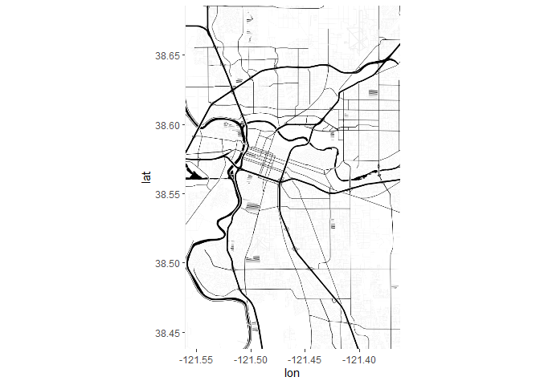
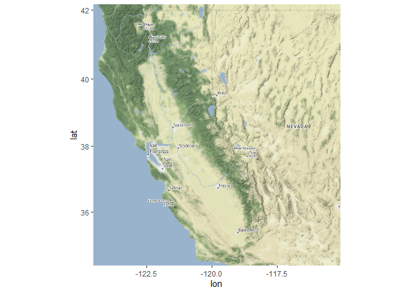
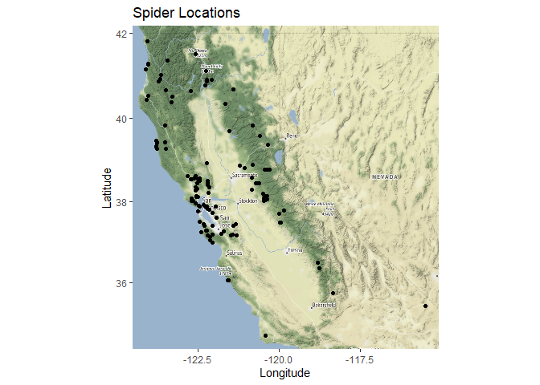
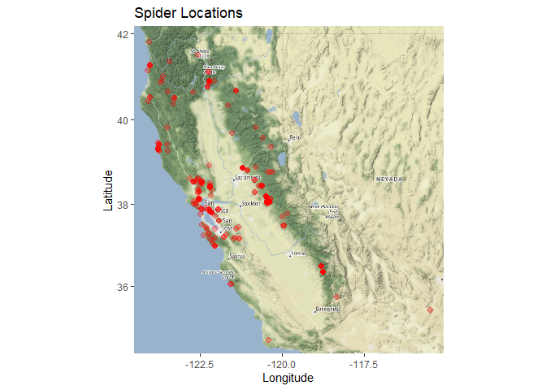
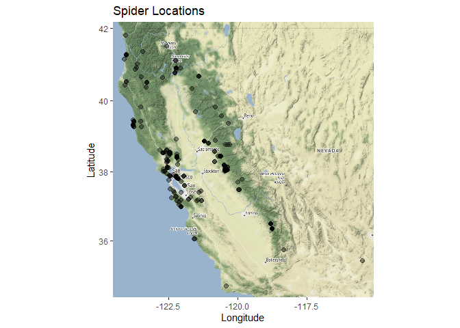
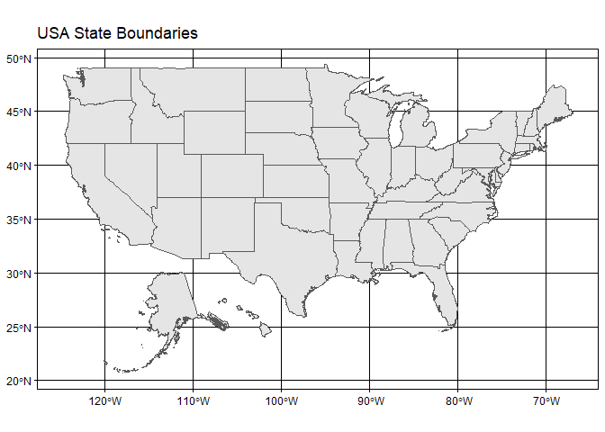
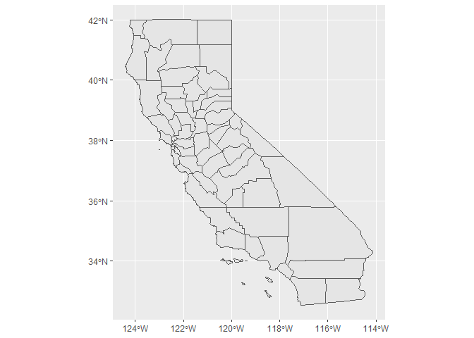
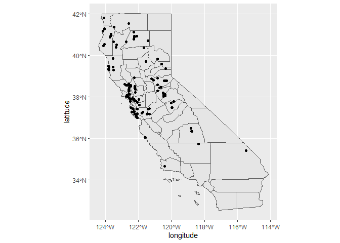
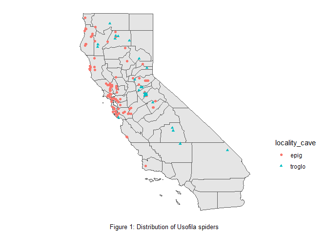

## Learning Goals
*At the end of this exercise, you will be able to:*  
1. Produce distribution maps in R.  
 
## Resources
[Overview of Cooordinate Reference Systems in R](https://www.nceas.ucsb.edu/~frazier/RSpatialGuides/OverviewCoordinateReferenceSystems.pdf)

## Spatial Data in R
There are many packages and techniques for working with spatial data in R. We will cover just some of the basics. One nice package is `ggmap`, which allows us to get base maps from Google Maps, OpenStreetMap, and Stamen Maps. It also works well with `ggplot2`.  

If you completed part 1 of today's lab then you should have the following packages installed. If not, then you should get them going now. You need to do these in order!  

`devtools` and `ggmap`

```r
#install.packages("devtools")
#library(devtools)
#devtools::install_github("dkahle/ggmap")
```

`albersusa`

```r
#install.packages("albersusa")
#devtools::install_github("hrbrmstr/albersusa")
```

## Load the libraries

```r
library(tidyverse)
library(here)
library(janitor)
library(ggmap)
```

Let's load our processed data from the first part of the lab.

```r
spiders <- read_csv(here("lab12", "data", "spiders_with_locs.csv")) %>% clean_names()
```

There is an error in one of the coordinates that we will fix here.

```r
spiders <- spiders %>% filter(latitude<=42)
```

## Create Base Map
Our goal here is to plot the spiders locations from the columns which contain the latitude and longitude. First, we need to get a base map for plotting our points on. We could plot them without a base map, but that wouldn't give us any context as to where they are in space. To get a base map we specify a min and max of each x and y coordinate, and create a bounding box.  

We set the bounding box to a little outside our min and max locations with `f = 0.05`.    

`summary()` gives us our min and max.

```r
spiders %>% 
  select(latitude, longitude) %>% 
  summary()
```

```
##     latitude       longitude     
##  Min.   :34.67   Min.   :-124.1  
##  1st Qu.:37.88   1st Qu.:-122.5  
##  Median :38.19   Median :-122.1  
##  Mean   :38.47   Mean   :-121.6  
##  3rd Qu.:38.88   3rd Qu.:-120.5  
##  Max.   :41.80   Max.   :-115.5
```

Now we set the bounding box.

```r
lat <- c(34.67, 41.80)
long <- c(-124.1, -115.5)
bbox <- make_bbox(long, lat, f = 0.05) # slightly expand the bounding box
```

Let's get a base map for our bounding box area. We will use the stamen maps because they are free. There are several different map types, including: `terrain-labels`, `terrain-lines`, `toner`, `toner-2011`, `toner-background`, `toner-hybrid`, `toner-lines`, `toner-lite`, and `watercolor.`


```r
#install.packages("osmdata")
library(osmdata)
```

```
## Data (c) OpenStreetMap contributors, ODbL 1.0. https://www.openstreetmap.org/copyright
```

```r
sac_map <- get_map(getbb("Sacramento"), maptype = "toner-background")
```

```
## maptype = "toner-background" is only available with source = "stamen".
```

```
## resetting to source = "stamen"...
```

```
## Map tiles by Stamen Design, under CC BY 3.0. Data by OpenStreetMap, under ODbL.
```

```r
ggmap(sac_map)
```

<!-- -->


```r
#map2 <- get_map(bbox, source = "osm", maptype = "toner")
#ggmap(map2)
```


```r
map1 <- get_map(bbox, maptype = "terrain", source = "stamen")
```

```
## Map tiles by Stamen Design, under CC BY 3.0. Data by OpenStreetMap, under ODbL.
```

```r
ggmap(map1)
```

<!-- -->

## Adding Points to Base Map
`ggmap` works well with `ggplot2`. To add our points we only need to specify the x and y location similar to how we made charts in previous labs. 

```r
ggmap(map1) + 
  geom_point(data = spiders, aes(longitude, latitude)) +
  labs(x = "Longitude", y = "Latitude", title = "Spider Locations")
```

<!-- -->

## Practice
1. Map the spider locations with a different type of base map. Try to adjust the map using different aesthetics including `size`, `color`, and `alpha`.

```r
ggmap(map1) + 
  geom_point(data = spiders, aes(longitude, latitude),size = 2, color = "red", alpha = 0.3) +
  labs(x = "Longitude", y = "Latitude", title = "Spider Locations")
```

<!-- -->


```r
ggmap(map1) + 
  geom_point(data = spiders, aes(longitude, latitude), size = 2, alpha = 0.4) +
  labs(x = "Longitude", y = "Latitude", title = "Spider Locations")
```

<!-- -->

## Albers USA
The Albers USA [package](https://github.com/hrbrmstr/albersusa) is a very fast way to produce clean maps that include nice overlays of counties across the US. I haven't explored it fully, but here are some nice examples.

```r
library(albersusa)
```

State Boundaries.

```r
us_comp <- usa_sf() # get a composite map of the USA
us_comp
```

```
## Simple feature collection with 51 features and 13 fields
## Geometry type: MULTIPOLYGON
## Dimension:     XY
## Bounding box:  xmin: -124.7332 ymin: 20.63151 xmax: -66.9499 ymax: 49.38436
```

```
## old-style crs object detected; please recreate object with a recent sf::st_crs()
```

```
## Geodetic CRS:  WGS 84
## First 10 features:
```

```
## old-style crs object detected; please recreate object with a recent sf::st_crs()
## old-style crs object detected; please recreate object with a recent sf::st_crs()
```

```
##         geo_id fips_state                 name lsad census_area iso_3166_2
## 1  0400000US04         04              Arizona       113594.084         AZ
## 2  0400000US05         05             Arkansas        52035.477         AR
## 3  0400000US06         06           California       155779.220         CA
## 4  0400000US08         08             Colorado       103641.888         CO
## 5  0400000US09         09          Connecticut         4842.355         CT
## 6  0400000US11         11 District of Columbia           61.048         DC
## 7  0400000US13         13              Georgia        57513.485         GA
## 8  0400000US17         17             Illinois        55518.930         IL
## 9  0400000US18         18              Indiana        35826.109         IN
## 10 0400000US22         22            Louisiana        43203.905         LA
##      census pop_estimataes_base pop_2010 pop_2011 pop_2012 pop_2013 pop_2014
## 1   6392017             6392310  6411999  6472867  6556236  6634997  6731484
## 2   2915918             2915958  2922297  2938430  2949300  2958765  2966369
## 3  37253956            37254503 37336011 37701901 38062780 38431393 38802500
## 4   5029196             5029324  5048575  5119661  5191709  5272086  5355866
## 5   3574097             3574096  3579345  3590537  3594362  3599341  3596677
## 6    601723              601767   605210   620427   635040   649111   658893
## 7   9687653             9688681  9714464  9813201  9919000  9994759 10097343
## 8  12830632            12831587 12840097 12858725 12873763 12890552 12880580
## 9   6483802             6484192  6490308  6516560  6537632  6570713  6596855
## 10  4533372             4533479  4545581  4575972  4604744  4629284  4649676
##                          geometry
## 1  MULTIPOLYGON (((-112.5386 3...
## 2  MULTIPOLYGON (((-94.04296 3...
## 3  MULTIPOLYGON (((-120.2485 3...
## 4  MULTIPOLYGON (((-107.3178 4...
## 5  MULTIPOLYGON (((-72.39743 4...
## 6  MULTIPOLYGON (((-77.03299 3...
## 7  MULTIPOLYGON (((-84.81048 3...
## 8  MULTIPOLYGON (((-89.36603 4...
## 9  MULTIPOLYGON (((-84.80412 4...
## 10 MULTIPOLYGON (((-88.86507 2...
```

County boundaries in each state.

```r
cnty_comp <- counties_sf() # get a composite map of USA counties
cnty_comp
```

```
## Simple feature collection with 3143 features and 8 fields
## Geometry type: MULTIPOLYGON
## Dimension:     XY
## Bounding box:  xmin: -124.7332 ymin: 20.63151 xmax: -66.9499 ymax: 49.38436
```

```
## old-style crs object detected; please recreate object with a recent sf::st_crs()
```

```
## Geodetic CRS:  WGS 84
## First 10 features:
```

```
## old-style crs object detected; please recreate object with a recent sf::st_crs()
## old-style crs object detected; please recreate object with a recent sf::st_crs()
```

```
##     fips state_fips county_fips      name   lsad census_area   state iso_3166_2
## 1  01001         01         001   Autauga County     594.436 Alabama         AL
## 2  01009         01         009    Blount County     644.776 Alabama         AL
## 3  01017         01         017  Chambers County     596.531 Alabama         AL
## 4  01021         01         021   Chilton County     692.854 Alabama         AL
## 5  01033         01         033   Colbert County     592.619 Alabama         AL
## 6  01045         01         045      Dale County     561.150 Alabama         AL
## 7  01051         01         051    Elmore County     618.485 Alabama         AL
## 8  01065         01         065      Hale County     643.943 Alabama         AL
## 9  01079         01         079  Lawrence County     690.678 Alabama         AL
## 10 01083         01         083 Limestone County     559.936 Alabama         AL
##                          geometry
## 1  MULTIPOLYGON (((-86.49677 3...
## 2  MULTIPOLYGON (((-86.5778 33...
## 3  MULTIPOLYGON (((-85.18413 3...
## 4  MULTIPOLYGON (((-86.51734 3...
## 5  MULTIPOLYGON (((-88.13999 3...
## 6  MULTIPOLYGON (((-85.41644 3...
## 7  MULTIPOLYGON (((-86.33678 3...
## 8  MULTIPOLYGON (((-87.4212 32...
## 9  MULTIPOLYGON (((-87.10507 3...
## 10 MULTIPOLYGON (((-86.83631 3...
```

Map of the USA- notice that you can still use themes. `geom_sf` stands for simple feature.

```r
ggplot() + 
  geom_sf(data = us_comp, size = 0.125) + 
  theme_linedraw()+
  labs(title = "USA State Boundaries")
```

```
## old-style crs object detected; please recreate object with a recent sf::st_crs()
## old-style crs object detected; please recreate object with a recent sf::st_crs()
```

<!-- -->

Since we want to produce a map of our spiders we need to restrict the map to California.

```r
ca_comp <- us_comp %>% 
  filter(name=="California")
```

```
## old-style crs object detected; please recreate object with a recent sf::st_crs()
```


```r
ca_cnty_comp <- cnty_comp %>% 
  filter(state=="California")
```

```
## old-style crs object detected; please recreate object with a recent sf::st_crs()
```

Our base map

```r
ggplot() +
  geom_sf(data = ca_comp, size = 0.125)+
  geom_sf(data = ca_cnty_comp, size = 0.125)
```

<!-- -->

All we do now is add the `geom_point()` layer.

```r
ggplot() +
  geom_sf(data = ca_comp, size = 0.125)+
  geom_sf(data = ca_cnty_comp, size = 0.125)+
  geom_point(data = spiders, aes(longitude, latitude))
```

<!-- -->

We can spice things up a bit by adding aesthetics.

```r
ggplot() +
  geom_sf(data = ca_comp, size = 0.125)+
  geom_sf(data = ca_cnty_comp, size = 0.125)+
  geom_point(data = spiders, aes(longitude, latitude))+
  labs(x = "Figure 1: Distribution of Usofila spiders")+
  theme_minimal() +
  theme(axis.text = element_blank()) +
  theme(axis.title.x = element_text(hjust=0.5, size = 10)) +
  theme(axis.title.y = element_blank()) +
  theme(panel.grid = element_blank()) +
  theme(legend.position = c(0.9, 0.3)) -> uso_map

ggsave(filename = "map.svg", device = "svg", plot = uso_map, height = 5, width = 7)
```

## Practice
1. Make a new new column that labels each specimen as occurring in a cave or on the surface. The word "Cave" is part of the locality information.

```r
spiders2 <- spiders %>% 
     mutate(locality_cave = if_else(str_detect(locality, "Cave"), "troglo", "epig"))
spiders2
```

```
## # A tibble: 269 × 12
##    access…¹ family genus country state county local…² date       colle…³ latit…⁴
##       <dbl> <chr>  <chr> <chr>   <chr> <chr>  <chr>   <date>     <chr>     <dbl>
##  1  9038521 Telem… Usof… USA     Cali… Alame… Berkel… 2019-03-02 LM Smi…    37.9
##  2  9038522 Telem… Usof… USA     Cali… Alame… Castro… 2019-03-24 WM Pea…    37.7
##  3  9038523 Telem… Usof… USA     Cali… Alame… Niles,… 2019-01-02 V Roth     37.6
##  4  9038524 Telem… Usof… USA     Cali… Alame… Oakland 2019-02-18 WG Ben…    37.8
##  5  9038525 Telem… Usof… USA     Cali… Alame… Oakland 2019-01-25 R Schu…    37.8
##  6  9038526 Telem… Usof… USA     Cali… Alame… Oakland 2019-02-18 WC Ben…    37.8
##  7  9038527 Telem… Usof… USA     Cali… Alame… Oakland 2019-12-10 J Helf…    37.8
##  8 90386281 Telem… Usof… USA     Cali… Alame… Oaklan… 2019-10-17 Roth, …    37.8
##  9  9038529 Telem… Usof… USA     Cali… Alame… Oaklan… 2019-10-17 Roth, …    37.8
## 10 90387441 Telem… Usof… USA     Cali… Alame… Berkel… 2019-02-17 PR Cra…    37.9
## # … with 259 more rows, 2 more variables: longitude <dbl>, locality_cave <chr>,
## #   and abbreviated variable names ¹​accession, ²​locality, ³​collector, ⁴​latitude
```

```r
str(spiders2)
```

```
## tibble [269 × 12] (S3: tbl_df/tbl/data.frame)
##  $ accession    : num [1:269] 9038521 9038522 9038523 9038524 9038525 ...
##  $ family       : chr [1:269] "Telemidae" "Telemidae" "Telemidae" "Telemidae" ...
##  $ genus        : chr [1:269] "Usofila" "Usofila" "Usofila" "Usofila" ...
##  $ country      : chr [1:269] "USA" "USA" "USA" "USA" ...
##  $ state        : chr [1:269] "California" "California" "California" "California" ...
##  $ county       : chr [1:269] "Alameda" "Alameda" "Alameda" "Alameda" ...
##  $ locality     : chr [1:269] "Berkeley" "Castro Valley" "Niles, off Niles Cyn. on Palomares Rd." "Oakland" ...
##  $ date         : Date[1:269], format: "2019-03-02" "2019-03-24" ...
##  $ collector    : chr [1:269] "LM Smith" "WM Pearce" "V Roth" "WG Bentinck" ...
##  $ latitude     : num [1:269] 37.9 37.7 37.6 37.8 37.8 ...
##  $ longitude    : num [1:269] -122 -122 -122 -122 -122 ...
##  $ locality_cave: chr [1:269] "epig" "epig" "epig" "epig" ...
```

```r
spiders2$locality_cave<-as.factor(spiders2$locality_cave)
str(spiders2)
```

```
## tibble [269 × 12] (S3: tbl_df/tbl/data.frame)
##  $ accession    : num [1:269] 9038521 9038522 9038523 9038524 9038525 ...
##  $ family       : chr [1:269] "Telemidae" "Telemidae" "Telemidae" "Telemidae" ...
##  $ genus        : chr [1:269] "Usofila" "Usofila" "Usofila" "Usofila" ...
##  $ country      : chr [1:269] "USA" "USA" "USA" "USA" ...
##  $ state        : chr [1:269] "California" "California" "California" "California" ...
##  $ county       : chr [1:269] "Alameda" "Alameda" "Alameda" "Alameda" ...
##  $ locality     : chr [1:269] "Berkeley" "Castro Valley" "Niles, off Niles Cyn. on Palomares Rd." "Oakland" ...
##  $ date         : Date[1:269], format: "2019-03-02" "2019-03-24" ...
##  $ collector    : chr [1:269] "LM Smith" "WM Pearce" "V Roth" "WG Bentinck" ...
##  $ latitude     : num [1:269] 37.9 37.7 37.6 37.8 37.8 ...
##  $ longitude    : num [1:269] -122 -122 -122 -122 -122 ...
##  $ locality_cave: Factor w/ 2 levels "epig","troglo": 1 1 1 1 1 1 1 1 1 1 ...
```

2. Now adjust the plot above to give a different color for specimens that occur in caves.

```r
spiders2 %>% ggplot() +
  geom_sf(data = ca_comp, size = 0.125)+
  geom_sf(data = ca_cnty_comp, size = 0.125)+
  geom_point(aes(x = longitude, y = latitude, color = locality_cave, shape = locality_cave))+
  labs(x = "Figure 1: Distribution of Usofila spiders")+
  theme_minimal() +
  theme(axis.text = element_blank()) +
  theme(axis.title.x = element_text(hjust=0.5, size = 10)) +
  theme(axis.title.y = element_blank()) +
  theme(panel.grid = element_blank()) +
  theme(legend.position = c(1.2, 0.3))
```

<!-- -->

## That's it, let's take a break!   

-->[Home](https://jmledford3115.github.io/datascibiol/)
