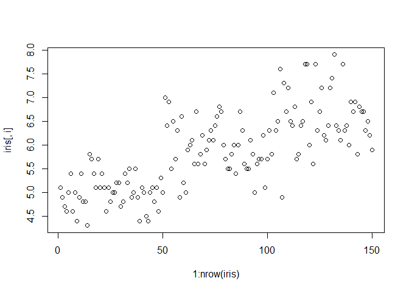
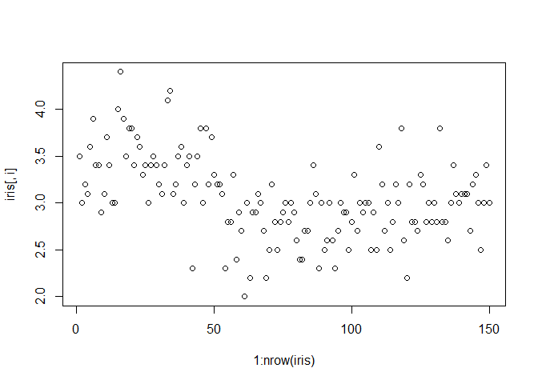
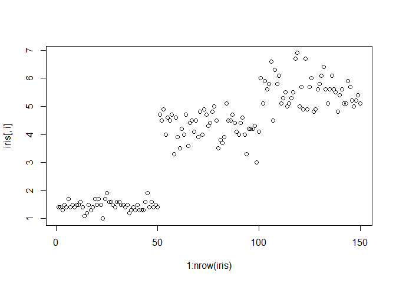
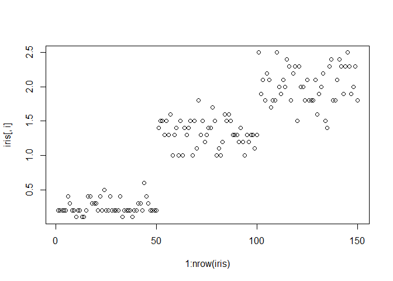

```r
library("tidyverse")
```


# A Tutorial on Loops in R

What Are Loops?

A loop is a programming instruction that repeats until a specific condition is reached.

The loop executes a code block again and again until no further action is required.

Each time the code block within the loop is executed is called an iteration.


## Different Types of Loops

Depending on your specific programming situation, you may need different loop-structures that execute the code blocks within the loop on the basis of different conditions.

The R programming language generally provides three different types of loops: for-loops, while-loops, and repeat-loops. 

## For-Loops

> for-loops specify a collection of objects (e.g. elements in a vector or list) to which a code block should be applied.

### Syntax of for loop


```r
#for (variable in vector) {
#  do something
#}
```

> Using the names above, each iteration of variable takes the value of one of the elements of vector. Here’s one example:

#### example 0: Loop Through Vector in R (Basics)


```r
for (i in 1:10) {
  print(i^2)
}
```

```
## [1] 1
## [1] 4
## [1] 9
## [1] 16
## [1] 25
## [1] 36
## [1] 49
## [1] 64
## [1] 81
## [1] 100
```

#### example 1. count the number of even numbers in a vector


```r
x <- c(1,2,5,3,10,9,8,11,6)
count <- 0

for (i in x) {
  if(i %% 2 == 0)  
    print(i)
}
```

```
## [1] 2
## [1] 10
## [1] 8
## [1] 6
```


```r
for (i in x) {
  if(i %% 2 == 0)  
    count = count+1
}

print(count)
```

```
## [1] 4
```

```r
random_number <- sample(1:1000, size = 100)
random_number
```

```
##   [1] 297 572  82 781 201 273 252 822 769 911 576 984 330 400   2  57 581 807
##  [19] 166  85 173 925 233 762 172 219 218 177 513 197 461 503 417 621 220 407
##  [37]   6 102 940 154 383  41 926 532 977  75  38 684 390 353 288 761 800 114
##  [55] 479 756 949 363 759 554 412 983 609 537 816 496 804 129 205 270 325 746
##  [73] 733 666 845 587 515 997 234 209 569 317 191 528 261 345 711 842 271 910
##  [91]   5 521 452 877 951 431 408 601 722 500
```

```r
for (i in random_number) {
  if(i %% 2 == 0)  
    count = count+1
}

print(count)
```

```
## [1] 47
```
### for-Loop Through Columns of Data Frame


```r
data <- data.frame(x1 = 1:5,    # Create example data
                   x2 = 6:10,
                   x3 = 11:15)
data 
```

```
##   x1 x2 x3
## 1  1  6 11
## 2  2  7 12
## 3  3  8 13
## 4  4  9 14
## 5  5 10 15
```


```r
data1 <- data # Replicate example data

for(i in 1:ncol(data1)) {       # for-loop over columns
  data1[ , i] <- data1[ , i] + 10
}
data1
```

```
##   x1 x2 x3
## 1 11 16 21
## 2 12 17 22
## 3 13 18 23
## 4 14 19 24
## 5 15 20 25
```

### for-Loop Over Rows of Data Frame


```r
data2 <- data                   # Replicate example data

for(i in 1:nrow(data2)) {       # for-loop over rows
  data2[i, ] <- data2[i, ] - 100
}
data2
```

```
##    x1  x2  x3
## 1 -99 -94 -89
## 2 -98 -93 -88
## 3 -97 -92 -87
## 4 -96 -91 -86
## 5 -95 -90 -85
```

### for-Loop Over Data Frame Columns


```r
data(iris)                                                 # Loading iris flower data set
head(iris)                                                 # Inspecting iris flower data set
```

```
##   Sepal.Length Sepal.Width Petal.Length Petal.Width Species
## 1          5.1         3.5          1.4         0.2  setosa
## 2          4.9         3.0          1.4         0.2  setosa
## 3          4.7         3.2          1.3         0.2  setosa
## 4          4.6         3.1          1.5         0.2  setosa
## 5          5.0         3.6          1.4         0.2  setosa
## 6          5.4         3.9          1.7         0.4  setosa
```


```r
iris1 <- iris                                          # Replicate iris data set

for(i in 1:ncol(iris1)) {                              # Head of for-loop
 
  if(grepl("Width", colnames(iris1)[i])) {             # Logical condition
 
    iris1[ , i] <- iris1[ , i] * 10              # Code block
  }
}

head(iris1)
```

```
##   Sepal.Length Sepal.Width Petal.Length Petal.Width Species
## 1          5.1          35          1.4           2  setosa
## 2          4.9          30          1.4           2  setosa
## 3          4.7          32          1.3           2  setosa
## 4          4.6          31          1.5           2  setosa
## 5          5.0          36          1.4           2  setosa
## 6          5.4          39          1.7           4  setosa
```

### Example 9: Creating Multiple Plots within for-Loop


```r
for(i in 1:(ncol(iris) - 1)) {                             # Head of for-loop
 
  plot(1:nrow(iris), iris[ , i])                           # Code block
  Sys.sleep(1)                                             # Pause code execution
}
```

<!-- --><!-- --><!-- --><!-- -->


### Looping over files

#### Let’s download some simulated satellite collar data


```r
#download.file("http://www.datacarpentry.org/semester-biology/data/locations.zip", "locations.zip")
#unzip("locations.zip")
```


```r
list.files()
```

```
##  [1] "collar-data-A1-2016-02-26.txt"  "collar-data-B2-2016-02-26.txt" 
##  [3] "collar-data-C3-2016-02-26.txt"  "collar-data-D4-2016-02-26.txt" 
##  [5] "collar-data-E5-2016-02-26.txt"  "collar-data-F6-2016-02-26.txt" 
##  [7] "collar-data-G7-2016-02-26.txt"  "collar-data-H8-2016-02-26.txt" 
##  [9] "collar-data-I9-2016-02-26.txt"  "collar-data-J10-2016-02-26.txt"
## [11] "collar.zip"                     "data"                          
## [13] "locations-2016-01-01.txt"       "locations-2016-01-02.txt"      
## [15] "locations-2016-01-03.txt"       "locations-2016-01-04.txt"      
## [17] "locations-2016-01-05.txt"       "locations.zip"                 
## [19] "loop.Rmd"                       "loop_files"
```


```r
data_files <- list.files(pattern = "locations-2*", 
                        full.names = TRUE)
data_files
```

```
## [1] "./locations-2016-01-01.txt" "./locations-2016-01-02.txt"
## [3] "./locations-2016-01-03.txt" "./locations-2016-01-04.txt"
## [5] "./locations-2016-01-05.txt"
```

```r
str(data_files)
```

```
##  chr [1:5] "./locations-2016-01-01.txt" "./locations-2016-01-02.txt" ...
```

```r
results <- vector(mode = "integer", length = length(data_files))
results
```

```
## [1] 0 0 0 0 0
```


```r
for (i in 1:length(data_files)){
  data0 <- read_csv(data_files[i])
  count <- nrow(data0)
  results[i] <- count
}
```

```
## 
## -- Column specification --------------------------------------------------------
## cols(
##   date = col_date(format = ""),
##   collar = col_character(),
##   time = col_time(format = ""),
##   lat = col_double(),
##   long = col_double()
## )
## 
## 
## -- Column specification --------------------------------------------------------
## cols(
##   date = col_date(format = ""),
##   collar = col_character(),
##   time = col_time(format = ""),
##   lat = col_double(),
##   long = col_double()
## )
## 
## 
## -- Column specification --------------------------------------------------------
## cols(
##   date = col_date(format = ""),
##   collar = col_character(),
##   time = col_time(format = ""),
##   lat = col_double(),
##   long = col_double()
## )
## 
## 
## -- Column specification --------------------------------------------------------
## cols(
##   date = col_date(format = ""),
##   collar = col_character(),
##   time = col_time(format = ""),
##   lat = col_double(),
##   long = col_double()
## )
## 
## 
## -- Column specification --------------------------------------------------------
## cols(
##   date = col_date(format = ""),
##   collar = col_character(),
##   time = col_time(format = ""),
##   lat = col_double(),
##   long = col_double()
## )
```

```r
results
```

```
## [1]  4  8 10 10 12
```

https://datacarpentry.org/semester-biology/materials/for-loops-R/

https://datacarpentry.org/semester-biology/exercises/Loops-multi-file-analysis-R/

### Storing loop results in a data frame


```r
results <- data.frame(file_name = vector(mode = "character", length = length(data_files)),
                      count = vector(mode = "integer", length = length(data_files)),
                      long = vector(mode = "numeric", length = length(data_files)))
results
```

```
##   file_name count long
## 1               0    0
## 2               0    0
## 3               0    0
## 4               0    0
## 5               0    0
```


```r
for (i in 1:length(data_files)){
  data0 <- read_csv(data_files[i])
  count <- nrow(data0)
  results$file_name[i] <- data_files[i]
  results$count[i] <- count
  results$long[i] <- data0$long
  results$lat[i] <- data0$lat
}
```

```
## 
## -- Column specification --------------------------------------------------------
## cols(
##   date = col_date(format = ""),
##   collar = col_character(),
##   time = col_time(format = ""),
##   lat = col_double(),
##   long = col_double()
## )
```

```
## Warning in results$long[i] <- data0$long: 被替換的項目不是替換值長度的倍數
```

```
## Warning in results$lat[i] <- data0$lat: 被替換的項目不是替換值長度的倍數
```

```
## 
## -- Column specification --------------------------------------------------------
## cols(
##   date = col_date(format = ""),
##   collar = col_character(),
##   time = col_time(format = ""),
##   lat = col_double(),
##   long = col_double()
## )
```

```
## Warning in results$long[i] <- data0$long: 被替換的項目不是替換值長度的倍數

## Warning in results$long[i] <- data0$long: 被替換的項目不是替換值長度的倍數
```

```
## 
## -- Column specification --------------------------------------------------------
## cols(
##   date = col_date(format = ""),
##   collar = col_character(),
##   time = col_time(format = ""),
##   lat = col_double(),
##   long = col_double()
## )
```

```
## Warning in results$long[i] <- data0$long: 被替換的項目不是替換值長度的倍數

## Warning in results$long[i] <- data0$long: 被替換的項目不是替換值長度的倍數
```

```
## 
## -- Column specification --------------------------------------------------------
## cols(
##   date = col_date(format = ""),
##   collar = col_character(),
##   time = col_time(format = ""),
##   lat = col_double(),
##   long = col_double()
## )
```

```
## Warning in results$long[i] <- data0$long: 被替換的項目不是替換值長度的倍數

## Warning in results$long[i] <- data0$long: 被替換的項目不是替換值長度的倍數
```

```
## 
## -- Column specification --------------------------------------------------------
## cols(
##   date = col_date(format = ""),
##   collar = col_character(),
##   time = col_time(format = ""),
##   lat = col_double(),
##   long = col_double()
## )
```

```
## Warning in results$long[i] <- data0$long: 被替換的項目不是替換值長度的倍數

## Warning in results$long[i] <- data0$long: 被替換的項目不是替換值長度的倍數
```

```r
results
```

```
##                    file_name count   long   lat
## 1 ./locations-2016-01-01.txt     4 -35.28 26.26
## 2 ./locations-2016-01-02.txt     8 -35.35 26.24
## 3 ./locations-2016-01-03.txt    10 -35.10 26.16
## 4 ./locations-2016-01-04.txt    10 -35.10 26.16
## 5 ./locations-2016-01-05.txt    12 -35.10 26.16
```

### loops practice: Multi-file Analysis

1. You have a satellite collars on a number of different individuals and want to be able to quickly look at all of their recent movements at once. The data is posted daily to a url as a zip file that contains one csv file for each individual: http://www.datacarpentry.org/semester-biology/data/individual_collar_data.zip Start your solution by:

* Downloading the zip file using download.file()
* Unziping it using unzip()
* Obtaining a list of all of the files with file names matching the pattern "collar-data-.*.txt"


```r
#download.file("http://www.datacarpentry.org/semester-biology/data/individual_collar_data.zip", "collar.zip")
#unzip("collar.zip")
```
2. Use a loop to load each of these files into R and make a line plot (using geom_path()) for each file with long on the x axis and lat on the y axis. Graphs, like other types of output, won’t display inside a loop unless you explicitly display them, so you need put your ggplot() command inside a print() statement. Include the name of the file in the graph as the graph title using labs().


## While-Loops

while-loops repeat a code block as long as a certain logical condition is TRUE.

This code is typically used when we don’t know the exact number of times our R code needs to be executed.

### example 0: Writing while-Loop in R (Basics)


```r
x_while <- 0                  # Preliminary specification of data object

while(x_while < 10) {         # Head of while-loop
 
  x_while <- x_while + 1      # Body of while-loop
  print(x_while)
}
```

```
## [1] 1
## [1] 2
## [1] 3
## [1] 4
## [1] 5
## [1] 6
## [1] 7
## [1] 8
## [1] 9
## [1] 10
```
### example 1: while-Loop Through Columns of Data Frame


```r
data3 <- data                   # Replicate example data

i <- 1                          # Create running index

while(i <= 2) {                  # Start while-loop
  data3[ , i] <- data3[ , i] + 100
  i <- i + 1
}

data3
```

```
##    x1  x2 x3
## 1 101 106 11
## 2 102 107 12
## 3 103 108 13
## 4 104 109 14
## 5 105 110 15
```

### example 2: Running while-Loop Through Data Frame Columns


```r
data(iris)                                        # Loading exemplifying data set
head(iris)                                        # Showing head of data in RStudio console
```

```
##   Sepal.Length Sepal.Width Petal.Length Petal.Width Species
## 1          5.1         3.5          1.4         0.2  setosa
## 2          4.9         3.0          1.4         0.2  setosa
## 3          4.7         3.2          1.3         0.2  setosa
## 4          4.6         3.1          1.5         0.2  setosa
## 5          5.0         3.6          1.4         0.2  setosa
## 6          5.4         3.9          1.7         0.4  setosa
```

```r
iris2 <- iris                   # Replicate example data
```


```r
running_index <- 1                                       # Create index

while(is.numeric(iris2[ , running_index])) {              # Start of while-loop
 
  iris2[ , running_index] <- iris2[ , running_index] * 10  # Code block
  running_index <- running_index + 1
 
}

head(iris2)                                               # Showing head of updated data
```

```
##   Sepal.Length Sepal.Width Petal.Length Petal.Width Species
## 1           51          35           14           2  setosa
## 2           49          30           14           2  setosa
## 3           47          32           13           2  setosa
## 4           46          31           15           2  setosa
## 5           50          36           14           2  setosa
## 6           54          39           17           4  setosa
```


## Repeat-Loops

repeat-loops repeat a code block until a break condition is fulfilled. This break condition marks the end of the loop.

repeat-loops follow a similar logic as while-loops, since they can also be used when the user doesn’t know the exact number of times the R code should be repeated. However, repeat-loops are not as popular as while-loops.

### example 0: Writing a repeat-Loop in R (Basics)


```r
x_repeat <- 0                 # Preliminary specification of data object

repeat{                       # Head of repeat-loop
 
  x_repeat <- x_repeat + 1    # Body of repeat-loop
  print(x_repeat)
 
  if(x_repeat >= 10) {        # Break condition of repeat-loop
 
    break
  }
}
```

```
## [1] 1
## [1] 2
## [1] 3
## [1] 4
## [1] 5
## [1] 6
## [1] 7
## [1] 8
## [1] 9
## [1] 10
```
### example 1: repeat-Loop Through Columns of Data Frame


```r
data4 <- data                   # Replicate example data

i <- 1                          # Create running index

repeat{                         # Start repeat-loop
 
  data4[ , i] <- data4[ , i] + 100
  i <- i + 1
 
  if(i > 2) {
    
    break
  }
}

data4
```

```
##    x1  x2 x3
## 1 101 106 11
## 2 102 107 12
## 3 103 108 13
## 4 104 109 14
## 5 105 110 15
```

### example 2: Running repeat-Loop Over Data Frame Columns


```r
data(iris)                          # Loading exemplifying data frame
head(iris)                          # Head of example data
```

```
##   Sepal.Length Sepal.Width Petal.Length Petal.Width Species
## 1          5.1         3.5          1.4         0.2  setosa
## 2          4.9         3.0          1.4         0.2  setosa
## 3          4.7         3.2          1.3         0.2  setosa
## 4          4.6         3.1          1.5         0.2  setosa
## 5          5.0         3.6          1.4         0.2  setosa
## 6          5.4         3.9          1.7         0.4  setosa
```

```r
iris3 <- iris                   # Replicate example data
```


```r
i <- 0                              # Create running index

repeat{                             # Start
 
  i <- i + 1                        # Update running index
 
  if(!is.numeric(iris3[ , i])) {     # Break condition
 
    break
  }
 
  iris3[ , i] <- iris3[ , i] * 10    # Change data
}
head(iris3)
```

```
##   Sepal.Length Sepal.Width Petal.Length Petal.Width Species
## 1           51          35           14           2  setosa
## 2           49          30           14           2  setosa
## 3           47          32           13           2  setosa
## 4           46          31           15           2  setosa
## 5           50          36           14           2  setosa
## 6           54          39           17           4  setosa
```


### other practice questions


```r
library(tidyverse)
```

## Load the data
For these exercises we will use the data from lab 4_1.  

```r
fish <- readr::read_csv("data/Gaeta_etal_CLC_data.csv")
```

```
## 
## -- Column specification --------------------------------------------------------
## cols(
##   lakeid = col_character(),
##   fish_id = col_double(),
##   annnumber = col_character(),
##   length = col_double(),
##   radii_length_mm = col_double(),
##   scalelength = col_double()
## )
```

```r
mammals <- readr::read_csv("data/mammal_lifehistories_v2.csv")
```

```
## 
## -- Column specification --------------------------------------------------------
## cols(
##   order = col_character(),
##   family = col_character(),
##   Genus = col_character(),
##   species = col_character(),
##   mass = col_double(),
##   gestation = col_double(),
##   newborn = col_double(),
##   weaning = col_double(),
##   `wean mass` = col_double(),
##   AFR = col_double(),
##   `max. life` = col_double(),
##   `litter size` = col_double(),
##   `litters/year` = col_double()
## )
```

To keep things tidy, I am going to rename the variables in the mammals data.  

```r
mammals <- rename(mammals, genus=Genus, wean_mass="wean mass", max_life="max. life", litter_size="litter size", litters_per_year="litters/year")
```


```r
str(mammals)
```

```
## tibble [1,440 x 13] (S3: spec_tbl_df/tbl_df/tbl/data.frame)
##  $ order           : chr [1:1440] "Artiodactyla" "Artiodactyla" "Artiodactyla" "Artiodactyla" ...
##  $ family          : chr [1:1440] "Antilocapridae" "Bovidae" "Bovidae" "Bovidae" ...
##  $ genus           : chr [1:1440] "Antilocapra" "Addax" "Aepyceros" "Alcelaphus" ...
##  $ species         : chr [1:1440] "americana" "nasomaculatus" "melampus" "buselaphus" ...
##  $ mass            : num [1:1440] 45375 182375 41480 150000 28500 ...
##  $ gestation       : num [1:1440] 8.13 9.39 6.35 7.9 6.8 5.08 5.72 5.5 8.93 9.14 ...
##  $ newborn         : num [1:1440] 3246 5480 5093 10167 -999 ...
##  $ weaning         : num [1:1440] 3 6.5 5.63 6.5 -999 ...
##  $ wean_mass       : num [1:1440] 8900 -999 15900 -999 -999 ...
##  $ AFR             : num [1:1440] 13.5 27.3 16.7 23 -999 ...
##  $ max_life        : num [1:1440] 142 308 213 240 -999 251 228 255 300 324 ...
##  $ litter_size     : num [1:1440] 1.85 1 1 1 1 1.37 1 1 1 1 ...
##  $ litters_per_year: num [1:1440] 1 0.99 0.95 -999 -999 2 -999 1.89 1 1 ...
##  - attr(*, "spec")=
##   .. cols(
##   ..   order = col_character(),
##   ..   family = col_character(),
##   ..   Genus = col_character(),
##   ..   species = col_character(),
##   ..   mass = col_double(),
##   ..   gestation = col_double(),
##   ..   newborn = col_double(),
##   ..   weaning = col_double(),
##   ..   `wean mass` = col_double(),
##   ..   AFR = col_double(),
##   ..   `max. life` = col_double(),
##   ..   `litter size` = col_double(),
##   ..   `litters/year` = col_double()
##   .. )
```

```r
str(fish)
```

```
## tibble [4,033 x 6] (S3: spec_tbl_df/tbl_df/tbl/data.frame)
##  $ lakeid         : chr [1:4033] "AL" "AL" "AL" "AL" ...
##  $ fish_id        : num [1:4033] 299 299 299 300 300 300 300 301 301 301 ...
##  $ annnumber      : chr [1:4033] "EDGE" "2" "1" "EDGE" ...
##  $ length         : num [1:4033] 167 167 167 175 175 175 175 194 194 194 ...
##  $ radii_length_mm: num [1:4033] 2.7 2.04 1.31 3.02 2.67 ...
##  $ scalelength    : num [1:4033] 2.7 2.7 2.7 3.02 3.02 ...
##  - attr(*, "spec")=
##   .. cols(
##   ..   lakeid = col_character(),
##   ..   fish_id = col_double(),
##   ..   annnumber = col_character(),
##   ..   length = col_double(),
##   ..   radii_length_mm = col_double(),
##   ..   scalelength = col_double()
##   .. )
```

## That's it! Take a break and I will see you on Zoom!  

